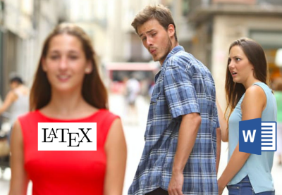

# clintp.xyz - my bio site &nbsp;


## Getting Started

This is a simple one page bio site that uses [vitepress](https://vitepress.dev/) with some basic CI/CD using [github actions](./.github/workflows/ci.yml) and a resume built using [latex](https://www.latex-project.org/)

### Prerequisites

### Site

* Node.js 18.x

### Installing

Install all our dependencies

```
$ npm install
```

## Development

To run a local web server for development

```
$ npm run docs:dev
```

## Running the tests


### End-to-end tests
```
npm run ci:e2e
```

## Building the site

To build a static website for hosting

```
npm run docs:build
```

## Deployment


This site is automatically built and deployed by [github actions](https://github.com/actions) to [Github Pages](https://pages.github.com/)


## Building the resume

My resume is built using [latex](https://www.latex-project.org/)



### Dependencies

You will need [ basictex ](https://tug.org/mactex/morepackages.html) installed in order to produce a pdf
or (what ever format you want)

Install basictex using homebrew

```
$ brew install basictex
```

The following packages are utilised in the latex document and will also need to be installed via latex's package manager

```
$ tlmgr install moresize raleway ly1 fontawesome
```

To export it to pdf

```
$ npm resume:export
```
